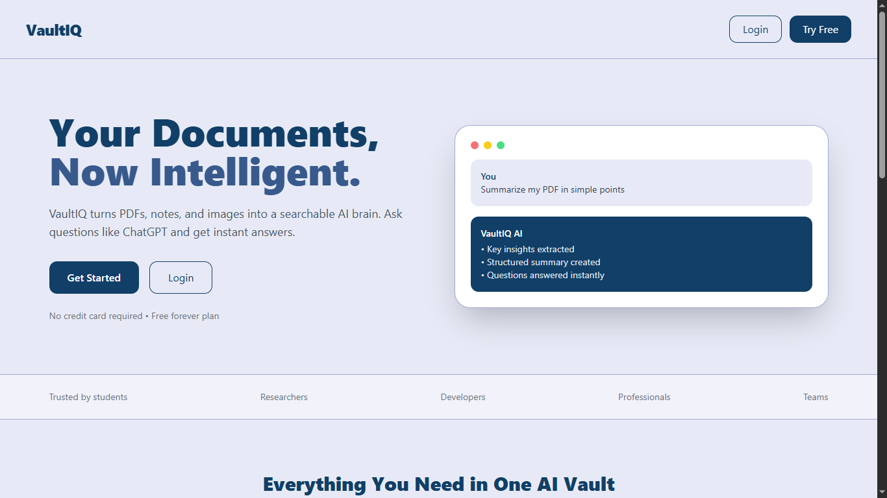
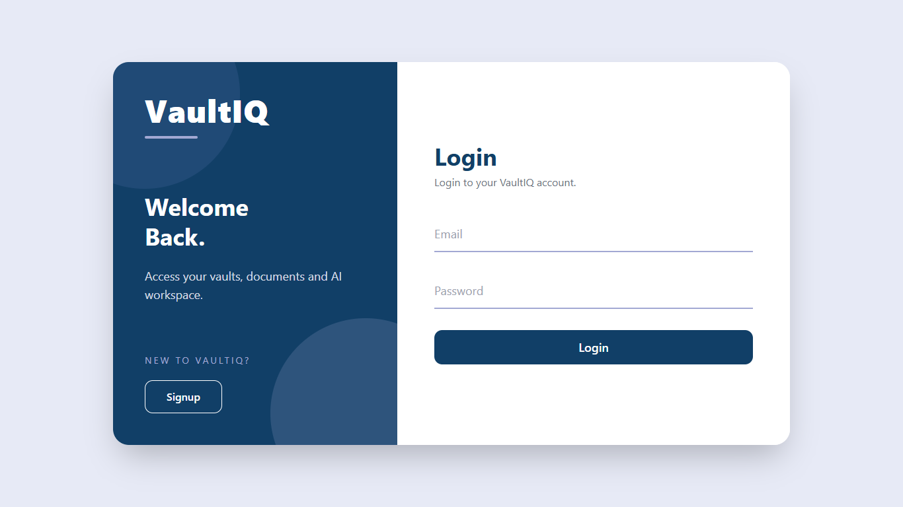
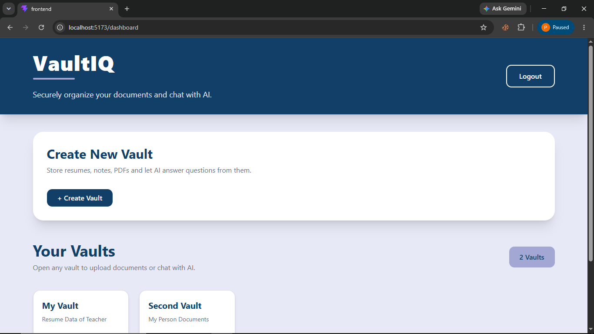
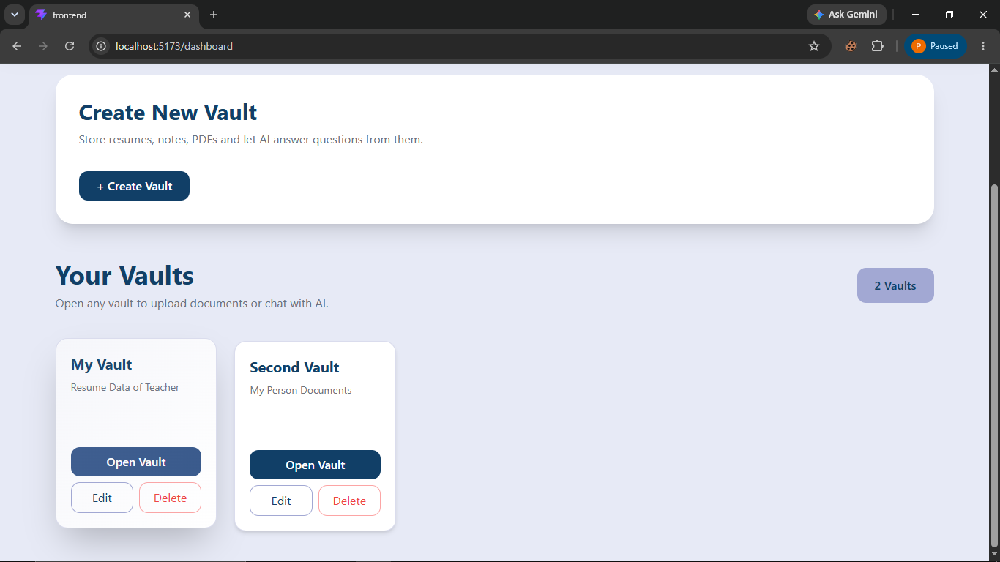
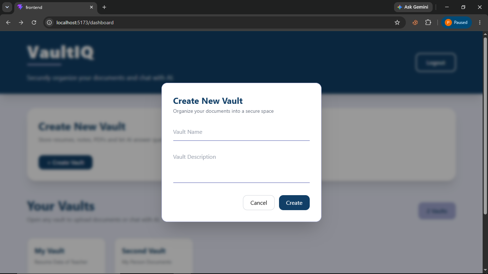
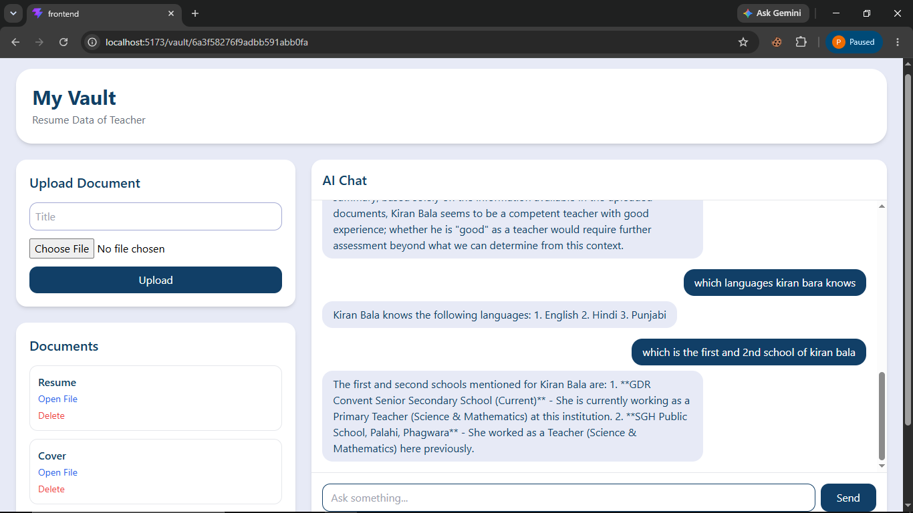

# 🧠 VaultIQ - AI Powered Document Intelligence Platform

VaultIQ is an **AI-powered document management platform** built using the **MERN Stack**. It allows users to securely organize documents into vaults, extract text from uploaded files, and interact with their documents using an integrated AI chatbot.

Whether it's PDFs, Word documents, text files, or images, VaultIQ transforms your documents into an intelligent knowledge base that you can chat with.

# 🚀 Features

## 🌐 Landing Page

- Modern responsive landing page
- Project overview
- Feature highlights
- Login & Signup access

## 👤 Authentication

- User Signup
- User Login
- JWT Authentication
- HTTP Only Cookie Authentication
- Persistent User Sessions

## 📂 Vault Management

  
  
  

- Create Vaults
- Edit Vault Details
- Delete Vaults
- Organize documents into separate vaults

## 📄 Document Management

- Upload Documents
- View Uploaded Documents
- Delete Documents
- Cloud Storage using Cloudinary

Supported File Types:

- PDF
- DOCX
- TXT
- Images (PNG, JPG, JPEG)

## 📝 Text Extraction

Automatic text extraction from uploaded documents using:

- PDF Parsing
- Mammoth (DOCX)
- OCR for Images (Tesseract.js)

Extracted text is stored securely and used for AI-powered document querying.

## 🤖 AI Document Chat

- Ask questions about uploaded documents
- AI responds only using uploaded document content
- Prevents hallucinated answers
- Friendly responses for greetings
- Chat history stored for every vault

## 💬 Chat History

- Every conversation is saved
- Chat history remains available until deleted
- Separate conversations for each vault

## ☁ File Storage

- Cloudinary Integration
- Secure Cloud Storage
- Fast file access

## ⚡ Performance

- React Query for API caching
- Fast API communication
- Responsive user interface
- Optimized React architecture

# 🛠 Tech Stack

## Frontend

- React.js
- Vite
- React Router DOM
- Tailwind CSS
- React Query
- Axios

## Backend

- Node.js
- Express.js
- MongoDB
- Mongoose
- JWT Authentication
- Cookie Parser
- Multer
- Cloudinary
- Ollama API

## AI & Document Processing

- Ollama (Llama 3)
- PDF Parse
- Mammoth
- Tesseract.js

# 📂 Project Structure

VaultIQ/

│
├── Frontend/
│   ├── src/
│   ├── Components/
│   ├── Pages/
│   ├── Services/
│   └── api/
│
├── Backend/
│   ├── Controllers/
│   ├── Models/
│   ├── Routes/
│   ├── Middlewares/
│   ├── Services/
│   ├── Config/
│   └── index.js
│
└── README.md

# ⚙ Installation

## Clone Repository

bash
git clone https://github.com/YOUR_USERNAME/VaultIQ.git

bash
cd VaultIQ

# Backend Setup

bash
cd Backend
npm install

Create a `.env` file inside the Backend folder.

Example:

env
PORT=8000

MONGO_URL=YOUR_MONGODB_CONNECTION_STRING

JWT_SECRET=YOUR_SECRET_KEY

CLIENT_URL=http://localhost:5173

CLOUD_NAME=YOUR_CLOUDINARY_NAME
API_KEY=YOUR_CLOUDINARY_API_KEY
API_SECRET=YOUR_CLOUDINARY_SECRET

OLLAMA_BASE_URL=http://localhost:11434
OLLAMA_MODEL=llama3

Run Backend
bash
npm run dev

# Frontend Setup

bash
cd Frontend
npm install

Create a `.env` file

env
VITE_API_URL=http://localhost:8000

Run Frontend

bash
npm run dev

# 🤖 Running Ollama

Install Ollama from:

https://ollama.com

Pull the Llama model:

bash
ollama pull llama3

Run Ollama

bash
ollama serve

# 🔐 Authentication

VaultIQ uses

- JWT Tokens
- HTTP Only Cookies
- Protected Routes

Each user has their own:

- Vaults
- Documents
- AI Chat History

# 📸 Main Pages

- Landing Page
- Login
- Signup
- Dashboard
- Vault Details
- AI Chat Interface

# 📁 Vault Workflow

1. Register/Login
2. Create a Vault
3. Upload Documents
4. AI extracts document text
5. Ask questions to AI
6. AI answers using uploaded documents
7. Chat history is automatically saved

# 🤖 AI Workflow

1. User uploads a document
2. Text is extracted
3. Text is stored in MongoDB
4. User asks a question
5. Relevant document content is sent to Ollama
6. AI generates a response
7. Conversation is saved in Chat History

# 📦 API Routes

## User

http
POST /user/signup

POST /user/login

POST /user/logout

## Vault

http
GET /vault

POST /vault

GET /vault/:vaultId

PUT /vault/:vaultId

DELETE /vault/:vaultId

## Document

http
POST /document/upload

GET /document/:vaultId

DELETE /document/:documentId

## AI

http
POST /ai/chat

GET /chat/:vaultId

# ✨ Future Improvements

- Semantic Search
- AI Summarization
- Multiple AI Models
- Voice Interaction
- Folder Support
- PDF Preview
- Drag & Drop Upload
- Real-time Streaming AI Responses
- Document Sharing
- Team Collaboration
- Role Based Access
- Vector Database Integration
- RAG Architecture

# 📚 Learning Outcomes

This project helped me learn:

- MERN Stack Development
- REST API Design
- JWT Authentication
- MongoDB Relationships
- File Upload Handling
- Cloudinary Integration
- Document Text Extraction
- OCR using Tesseract.js
- AI Integration with Ollama
- Prompt Engineering
- React Query
- Tailwind CSS
- Building an AI-powered Full Stack Application

# 👨‍💻 Author

**Raman**

GitHub:
https://github.com/Ramandeeep01

